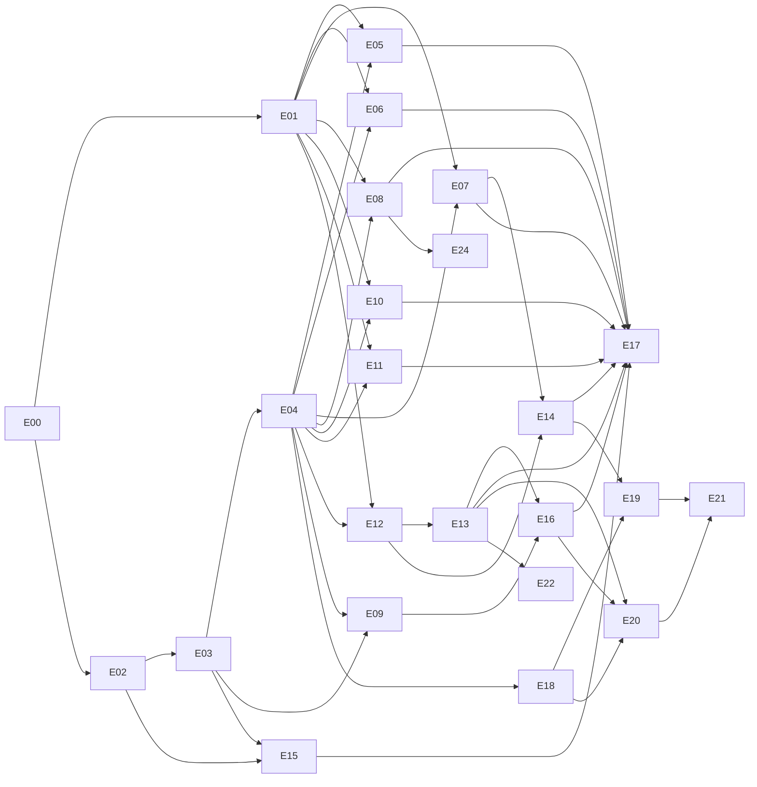

# Plano de execução · Cadência (Schedule Optimizer)

> Versão 1.0 · 11/09/2026
> Base: especificação consolidada v2.0, protótipo aprovado e tema shadcn, todos em `docs/referencia/`.
> Referências no texto: **§x.y** é seção da especificação, **Rnn** é linha do registro de requisitos (Parte I), **L1234** é linha do protótipo `cadencia-leverpro.html`.

## Como usar este documento

- São 26 etapas, de **E00** a **E25**, agrupadas nas quatro fases do roadmap (§11). Cada etapa traz objetivo, requisitos cobertos, tarefas com checkbox, entregáveis, critérios de aceite e dependências.
- Status: ✅ concluída · 🟡 em andamento · ⬜ não iniciada · ⛔ bloqueada.
- Ao concluir uma tarefa, marque o checkbox. Ao concluir a etapa, troque o status na tabela da seção 2.
- **Definição de pronto de toda etapa:** `pnpm typecheck`, `pnpm lint` e `pnpm build` verdes; testes da etapa passando; paridade visual conferida contra o protótipo nos dois temas em 1440px e 1180px; nenhuma cor fixa fora de `app/globals.css`; copy sem travessão; deploy de preview na Vercel funcionando; este plano atualizado.

---

## 1. Ponto de partida

### 1.1 O que já existe

| Item | Estado | Onde |
|---|---|---|
| Projeto Next.js 16.2.6, React 19.2, TypeScript, Tailwind v4 | ✅ criado com `pnpm dlx shadcn@latest init --preset b37aFvF3Y --template next --pointer` | raiz |
| Tokens LeverPro (claro e escuro) sobre o preset | ✅ | `app/globals.css` |
| Shell: sidebar 16rem/3rem, header de 64px, cenário, tema, 7 rotas | ✅ | `app/(app)/`, `components/cadencia/` |
| Supabase **Schedule Optimizer** | ✅ ref `bvccnzvvzidefhiakrez`, região sa-east-1 (São Paulo), Postgres 17, org Leverpro, linkado | `supabase/` |
| Vercel **schedule-optimizer** | ✅ time LEVERPRO (`leverproint`), região de funções gru1, variáveis públicas do Supabase em production, preview e development | `.vercel/`, `vercel.json` |
| Segredos locais | ✅ URL, publishable key, secret key e senha do banco em `.env.local`, fora do git | `.env.local` |
| Repositório GitHub | ⛔ o token atual não tem permissão para criar repositório (ver seção 9) | |
| Documentos de referência | ✅ | `docs/referencia/` |

### 1.2 Decisão sobre o preset

O preset pedido, `b37aFvF3Y`, abre em: style **base-nova** (componentes sobre Base UI), base zinc, primary neutro, gráficos em índigo, fonte Inter, Geist Mono, ícones lucide, menu default subtle e cursor pointer nos botões. O protótipo e a especificação usam o preset `b1YofKqES` (base mist, theme sky, chart blue).

**Decisão:** o `b37aFvF3Y` fornece a biblioteca de componentes, as fontes, os ícones e o comportamento. A paleta do protótipo foi sobreposta em `app/globals.css`, porque o pedido é replicar exatamente o design aprovado. A troca é reversível: basta substituir o bloco de tokens.

Consequência prática: os componentes usam a prop `render` do Base UI no lugar de `asChild` do Radix. Isso vale para todo exemplo de shadcn copiado da documentação.

### 1.3 Números de referência do protótipo

O motor do protótipo (L647 a L1509) foi executado em Node, sem navegador, com a semente 7, perfil Equilíbrio e horizonte de 4 semanas. Estes números são o alvo da paridade da E02 e servem de teste de fumaça para as telas.

| Medida | Agenda atual (baseline) | Otimizada |
|---|---|---|
| Projetos, pessoas, times | 112, 20, 4 (28 projetos por squad) | igual |
| Demanda por semana (S1 a S4) | 58, 59, 58, 58 | igual |
| Cerimônias alocadas na S1 | 58 | 56, com 2 adiadas |
| Cobertura total, obrigatórias | 100% | 96,6%, 98,1% |
| Com concessão, trocas de cadeira | n/a | 3, 5 |
| SLA de etapa | n/a | **88,9%** (8 de 9) |
| Aderência ao alvo | 70% | 85% |
| Tempo produtivo médio | 81,6% | 82,7% |
| Horas de cerimônia na semana | 116h | 109h |
| Blocos de foco por pessoa, fragmentação | 9,8, 0,15 | 10,1, 0,00 |
| Pessoas acima do teto | 6 | 3 |
| Déficit estrutural | n/a | 0,4 FTE |
| Mês projetado: reuniões, pessoa-hora | 252, 499,6h | 238, 464,9h |
| Tempo do solver | 49 ms para o horizonte inteiro | |

| Perfil (alvos padrão) | Cobertura | Obrigatórias | Aderência | Déficit |
|---|---|---|---|---|
| Foco máximo | 94,8% | 96,2% | 90% | 0,57 FTE |
| Equilíbrio, Prioridade ao cliente, Estabilidade | 96,6% | 98,1% | 85% | 0,40 FTE |

| Perfil (alvos +7 p.p.) | Cobertura | Obrigatórias | Aderência | Déficit |
|---|---|---|---|---|
| Foco máximo | 70,7% | 73,1% | 95% | 7,03 FTE |
| Equilíbrio | 75,9% | 78,8% | 75% | 5,10 FTE |
| Prioridade ao cliente | 75,9% | 78,8% | 80% | 5,10 FTE |

**Atenção ao defeito 15.** Estes números saem da semente como ela está, e nela 55% das cadeiras ignoram o time do projeto. Aplicando a regra do §2.0 (remontando todos os squads com `montarSquad`), o mesmo cenário fica mais apertado e mais honesto: cobertura de 96,6% para **89,7%**, obrigatórias de 98,1% para **94,2%**, adiadas de 2 para **6**, déficit de 0,40 para **0,61 FTE** e horas de 109 para 106. Em compensação, o **SLA de etapa fecha 100%**, porque a cadeira do kickoff que estourava o orçamento mensal passa a ser de outra pessoa. Quando a E03 semear respeitando o time, esta tabela precisa ser regravada, e a decisão D-07 pode se resolver sozinha.

Outros pontos de controle: mudar a Reunião de Trabalho de Construção de 4 para 2 semanas leva a demanda da S1 de **58 para 64**; a Reunião de Trabalho de Discovery responde por **27,9%** da pessoa-hora; as colunas calculadas por cargo batem com a matriz do §2.3 (Analista 33,0 / 5,9 / 7,3; Gerente de Projeto 29,2 / 12,3 / 15,2).

### 1.4 Arquitetura alvo

```
Navegador
  Next.js App Router (Server e Client Components)
  └─ Web Worker com o motor de domínio em TypeScript, para simulação instantânea
Vercel, região gru1
  ├─ Server Actions e Route Handlers: cadastros, execução persistida do motor, relatórios
  ├─ Cron semanal de planejamento (sexta)
  ├─ Agentes de IA (Claude API, @anthropic-ai/sdk)
  └─ Webhooks de calendário (Google Calendar, Microsoft Graph)
Supabase, região sa-east-1
  ├─ Postgres 17 com RLS: cadastros, premissas versionadas, cenários, ocorrências, auditoria
  ├─ Auth com Google Workspace, restrito ao domínio LeverPro
  ├─ Vault: credenciais de calendário
  └─ Fila solver_jobs
Worker CP-SAT (Python e OR-Tools), a partir da E15
```

| Camada | Escolha | Observação |
|---|---|---|
| Framework | Next.js 16.2.6, React 19.2 | ler `node_modules/next/dist/docs/` antes de cada API nova; `middleware` virou `proxy` |
| UI | shadcn base-nova, `@base-ui/react`, lucide, next-themes, Tailwind v4 | primitivas do produto em `components/cadencia/` |
| Gráficos | Recharts via `components/ui/chart.tsx` | anatomia do §14.2 |
| Dados | `@supabase/supabase-js`, `@supabase/ssr` | tipos gerados do banco |
| Estado | Zustand para mundo, cenário e resultado; `nuqs` para filtros e abas na URL | |
| Validação | Zod, também como contrato dos agentes de IA | |
| Datas | `date-fns` e `date-fns-tz`, fuso America/Sao_Paulo | |
| Testes | Vitest, Testing Library, Playwright (E2E e comparação visual) | |
| IA | `@anthropic-ai/sdk`, modelo `claude-opus-5` | E18 a E21 |
| Solver | Python 3.12, OR-Tools CP-SAT, FastAPI | E15 |

### 1.5 Estrutura de pastas alvo

```
app/
  (app)/layout.tsx, template.tsx          shell, entrada em cascata por navegação
  (app)/<tela>/page.tsx                   cockpit, agenda, otimizador, projetos, time, premissas, indicadores
  (auth)/entrar/page.tsx                  E03
  api/cron/planejamento-semanal/route.ts  E21
  api/calendario/<provedor>/webhook/      E16
  api/relatorios/mensal/route.ts          E08
components/
  ui/                                     gerado pelo CLI do shadcn, só ajustes de token
  cadencia/                               primitivas do produto (Indicador, Selo, Trilha, Modal...)
  telas/<tela>/                           composição de cada tela
lib/
  dominio/                                motor puro portado do protótipo (E02)
  dados/                                  clientes Supabase, repositórios, mapeadores (E04)
  estado/                                 store do cenário e hooks (E04)
  ia/                                     agentes e contratos (E18)
  calendario/                             Google e Microsoft Graph (E09, E16)
  formato.ts, cores.ts, navegacao.ts
workers/motor.worker.ts                   E02
supabase/migrations/, supabase/seed.sql   E03
solver/                                   worker CP-SAT (E15)
tests/unit, tests/paridade, tests/e2e
docs/referencia/, docs/PLANO-DE-EXECUCAO.md
```

---

## 2. Visão geral das etapas

| ID | Etapa | Fase (§11) | Depende de | Dias de dev | Status |
|---|---|---|---|---|---|
| E00 | Setup do projeto e infraestrutura | 1 Fundação | | 1 | 🟡 falta GitHub e CI |
| E01 | Design system Cadência | 1 Fundação | E00 | 5 | ⬜ |
| E02 | Motor de domínio em TypeScript | 1 Fundação | E00 | 5 | 🟡 porte e paridade prontos |
| E03 | Banco de dados, autenticação e RLS | 1 Fundação | E02 (tipos) | 4 | ⬜ |
| E04 | Camada de dados e estado da aplicação | 1 Fundação | E02, E03 | 3 | ⬜ |
| E05 | Tela Projetos | 1 Fundação | E01, E04 | 3 | ⬜ |
| E06 | Tela Time (Pessoas, Times, Cargos) | 1 Fundação | E01, E04 | 4 | ⬜ |
| E07 | Tela Premissas (Gerais, Por cargo, Urgência, Playbook) | 1 Fundação | E01, E04 | 5 | ⬜ |
| E08 | Tela Indicadores e relatório mensal | 1 Fundação | E01, E04 | 3 | ⬜ |
| E09 | Importação da agenda atual | 1 Fundação | E03, E04 | 6 | ⬜ |
| E10 | Tela Cockpit | 2 Otimizador | E01, E04 | 3 | ⬜ |
| E11 | Tela Agenda | 2 Otimizador | E01, E04 | 5 | ⬜ |
| E12 | Tela Otimizador e execução persistida | 2 Otimizador | E01, E04 | 5 | ⬜ |
| E13 | Cenários, publicação e estabilidade | 2 Otimizador | E12 | 5 | ⬜ |
| E14 | Premissas avançadas e modificadores automáticos | 2 Otimizador | E07, E12 | 4 | ⬜ |
| E15 | Solver CP-SAT | 2 Otimizador | E02, E03 | 10 | ⬜ |
| E16 | Escrita nos calendários e reconciliação | 2 Otimizador | E09, E13 | 8 | ⬜ |
| E17 | **Marco MVP**: aceite, hardening e go-live | 2 Otimizador | E05 a E16 | 5 | ⬜ |
| E18 | Fundação da camada de IA | 3 IA | E04 | 3 | ⬜ |
| E19 | Classificador, Planejador de Cadência, Compositor de Squad | 3 IA | E18, E14 | 5 | ⬜ |
| E20 | Narrador, Orquestrador, Sentinela | 3 IA | E18, E13, E16 | 6 | ⬜ |
| E21 | Planejamento semanal automatizado | 3 IA | E19, E20 | 3 | ⬜ |
| E22 | Simulação de contratação e déficit | 4 Inteligência | E13 | 4 | ⬜ |
| E23 | Integrações Tarefas, Projetos e RH | 4 Inteligência | E03, decisão D-08 | 6 | ⬜ |
| E24 | Custo por cliente e benchmark por produto | 4 Inteligência | E08 | 4 | ⬜ |
| E25 | Matriz de competências (condicional) | 4 Inteligência | decisão D-02 | 8 | ⬜ |

Total estimado: 123 dias de dev (Fase 1: 39, Fase 2: 45, Fase 3: 17, Fase 4: 22). O roadmap da especificação prevê 20 semanas; com duas trilhas em paralelo o prazo fecha com folga de cerca de 30%.

**Trilhas paralelas sugeridas**

- Trilha A (produto e interface): E01 → E05, E06, E07, E08 → E10, E11, E12 → E13 → E14.
- Trilha B (dados e integrações): E02 → E03 → E04 → E09 → E15 → E16.
- Depois do marco MVP (E17), as duas trilhas convergem em E18 a E21, e a Fase 4 é priorizada pela gestão.



---

## 3. Etapas detalhadas

### Fase 1 · Fundação

#### E00 · Setup do projeto e infraestrutura · 🟡

**Objetivo.** Projeto rodando com o preset, o design aprovado aplicado ao shell e a infraestrutura criada e conectada.
**Requisitos.** R39, R40, R53, R55.

- [x] Scaffold com `pnpm dlx shadcn@latest init --preset b37aFvF3Y --template next --pointer`
- [x] Documentos de referência em `docs/referencia/`
- [x] Tokens LeverPro em `app/globals.css`: cores dos dois temas, `success` e `warning` com pares, apelidos do protótipo (`sunken`, `line-soft`, `ink-2`, `accent-ink`, `accent-wash`, `ok/bad/warn-wash`), sombras, hachuras da agenda, chips por hue, grão, curva de movimento, `prefers-reduced-motion`
- [x] Inter e Geist Mono via `next/font`, `lang="pt-BR"`, tema claro como padrão (§14.1)
- [x] Componentes shadcn: sidebar, sheet, separator, tooltip, badge, tabs, table, dialog, input, select, switch, checkbox, progress, skeleton, popover, chart, empty, alert, sonner, label, field, scroll-area, dropdown-menu, card
- [x] Tooltip no padrão do §14.2 (fundo `primary`, texto `primary-foreground`)
- [x] Shell: `AppSidebar`, `SiteHeader`, `CenarioProvider`, `Segmentado`, `SecaoCabecalho`, `Vazio`, `TelaPendente`, sete rotas e redirecionamento de `/` para `/cockpit`
- [x] Supabase criado, `supabase init` e `supabase link`
- [x] Vercel: projeto criado, `vercel link`, variáveis públicas nos três ambientes, `vercel.json` com região gru1
- [x] `CLAUDE.md` com fontes de verdade e convenções
- [ ] Repositório GitHub privado e push (bloqueado, seção 9)
- [ ] `vercel git connect` para deploy automático por push e preview por PR
- [ ] GitHub Actions: lint, typecheck, testes e build em todo PR
- [ ] Proteção da branch `main`, template de PR, Conventional Commits
- [ ] `site_url` e redirects do Supabase Auth apontando para o domínio da Vercel

**Critérios de aceite.** Build verde; deploy de produção abre `/cockpit`; as sete rotas navegam; o tema alterna; o menu recolhe para 3rem com rótulo em tooltip.

#### E01 · Design system Cadência · ⬜

**Objetivo.** Todas as primitivas visuais do protótipo como componentes React tipados, idênticos em medida, cor e movimento, antes de qualquer dado real.
**Requisitos.** R40, R41, R43, R44, R48, R51, R54, §14.

**Tarefas: primitivas** (em `components/cadencia/`)

| Protótipo | Componente | Especificação |
|---|---|---|
| `.faixa`, `.ind` (L329) | `Faixa`, `Indicador` | 6 colunas, 3 abaixo de 1180px, gap 12px, margem inferior 26px; card com raio xl, borda e `shadow-xs`, padding 13/15/14; rótulo 11.5px 500 em `muted-foreground`; valor mono 25px 500, tracking −0.04em, com unidade separada em 12px; tons `bom` e `ruim` com unidade a 60%; rodapé mono 10.5px com altura mínima de 15px, contexto ou delta ▲ ▼ = "vs. atual" |
| `.sec-cab` | `SecaoCabecalho` | ✅ já existe |
| `.nota`, `.leitura` | `Nota`, `Leitura` | 12px e 12.5px, entrelinha 1.6 e 1.65, máximo de 78 caracteres, `<b>` em `foreground` |
| `.selo` | `Selo` | 10.5px 500, raio sm, borda; tons ok, aviso, ruim, neutro, acento e fase (hue via `--fh`) |
| `.ponto` | `PontoHealth` | 7px; verde, amarelo e vermelho mapeados para success, warning e destructive |
| `.trilha` | `Trilha` | 8px, trilho `primary/20`, preenchimento primary, success ou destructive, marcador de limite de 1px em `foreground/45`, transição de largura em 600ms |
| `.calor`, `.cel` | `MapaCalor` | coluna de nomes de 128px e 5 dias, gap 3px, célula de 22px com número mono 10px, fundo `color-mix(primary 12% a 90%, card)`, hover com escala 1.07, dica por célula |
| `.grade` | `GradeSemanal` | coluna de horas de 52px e 5 dias, linha de 31px por meia hora, zonas (fora da jornada, fora da faixa preferencial, janela protegida, almoço, dia protegido), linhas horizontais, blocos de cerimônia posicionados por slot, faixas lado a lado para simultâneas, `data-cedido` tracejado em warning, `data-meu` com contorno primary |
| `.mensal` | `GradeMensal` | coluna de 100px e 5 dias, células de 138px, até 6 cerimônias e "e mais N", célula vazia tracejada |
| `.tag-cer`, `.tag-neutra`, `.legenda` | `TagCerimonia`, `TagNeutra`, `Legenda` | 10.5px, raio sm, hue do tipo |
| `.seg` | `Segmentado` | ✅ já existe |
| `.abas`, `.aba` | `Abas` (sobre Tabs do base-nova) | trilho `muted` com raio lg, padding e gap de 3px, margem inferior 20px; aba 12.5px 500 com linha de apoio de 10px; ativa em `background` com `shadow-xs`; `role="tablist"`, `aria-selected` |
| `.chave` | `Chave` | Switch de 32 × 18.4px com polegar de 16px e rótulo à direita |
| `table` | `TabelaDensa` | cabeçalho de 38px, 12px 500, fixo no topo; células 8/10px com borda `line-soft`; hover `muted/55`; colunas `n` em mono à direita; células `calc` em `accent-wash/35` e `edt` em `muted/45` |
| `.cel-edit` | `CelulaNumerica` | input de 28px, mono 12px, alinhado à direita, transparente até o hover; limita a min e max ao digitar, normaliza ao sair |
| `.rolagem`, `.larga` | `AreaRolagem`, `TabelaLarga` | rolagem com altura máxima de 560px; tabela larga com borda e raio lg |
| `.painel` | `Painel` | cabeçalho 13/16px com título 13.5px, corpo 16px em grade com gap 16px |
| `.aviso` | `Aviso` | Alert em warning com ícone de triângulo, título 500 e descrição |
| `.vazio` | `Vazio` | ✅ já existe |
| `.esqueleto` | `Esqueleto` e esqueletos com a forma de cada tela | pulso de 1.6s |
| `.terminal` | `Terminal` | fundo `sunken`, mono 11px, linhas surgindo a cada 130ms, classes cmd, at e bom |
| `.dica-flut` | `Dica` | Tooltip já no padrão primary |
| `.fundo`, `.caixa`, `.editor` | `Modal`, `EditorCabecalho`, `Formulario`, `EditorRodape` | Dialog do base-nova: escurecimento preto a 50%, caixa `popover` com raio xl e `shadow-lg`, padding 22/24, larguras 520, 560, 680, 720 e 760; X de 26px; fecha por Esc e clique fora; trava a rolagem; foco no primeiro campo; animação `sobe` de 190ms. Formulário em 4 colunas (2 abaixo de 1100px) com `l2` e `l4`; rodapé com mensagem de erro à esquerda |
| confirmação | `ConfirmacaoModal` | 520px, texto que sempre diz a consequência, campo extra opcional (destino), botão perigo |
| `.pilula`, `.painel-filtro`, `.opcao` | `FiltroMultiplo` | pílula de 32px com rótulo, valor e chevron que gira; painel com busca de 200px, "N de M selecionados", Selecionar todos, Limpar seleção, Fechar; lista em colunas de 210px com altura máxima de 232px; opção com checkbox de 16px; nada marcado significa tudo |
| `.faixa-slots`, `.slot` | `FaixaSlots`, `SlotAlternavel` | 20 blocos de meia hora em 5 colunas, `aria-pressed`, desabilitado tracejado; reaproveitado nos editores de time e de cerimônia |
| `.resumo-prem` | `ResumoPremissas` | 6 caixas, número mono 16px |
| `.btn`, `.mini-btn` | variantes do `Button` | default de 32px, padding 14px, 12.5px, `shadow-xs`, hover `color-mix(primary 88%, foreground)`; leve (outline); perigo sólido em `destructive` com `destructive-foreground` (o base-nova usa tom suave, ajustar); fantasma; gatilho de 28px; quadrado de 32px; mini de 26px, 11.5px, raio sm |
| `barras()` (L1613) | `GraficoBarras`, `LegendaGrafico` | Recharts: `CartesianGrid` só horizontal, `strokeDasharray="3 3"`; eixos sem linha e sem tick, rótulos 11px em `muted-foreground`; barras em `chart-1` com cantos superiores de 6px e 62% da banda; rótulo de valor 11px 500; linha de referência tracejada por barra (4 3, 1.5px, opacidade 0.65) via shape customizado; cor por item; tooltip no hover; eixo Y opcional com 4 linhas |

**Tarefas: utilitários e verificação**

- [ ] `lib/formato.ts`: `hhmm(slot)`, `n1` e `n0` com vírgula decimal, `pc`, `primeiroNome`, `iniciais`, com testes
- [ ] `lib/cores.ts`: hues padrão das fases (kickoff 300, discovery 245, construção 145, homologação 35, go-live 170, sustentação 95), `HUE_CER` (L1566), hash de texto para hues novos, helper `estiloHue(h)` que devolve `{ "--fh": h }`
- [ ] Classes utilitárias `.chip-hue` para fundo, texto e borda em `oklch(var(--cor-chip-*) var(--fh))`
- [ ] Variantes do `Button` e do `Badge` ajustadas às medidas do protótipo, sem quebrar os componentes shadcn que dependem delas
- [ ] Vitrine `/design`, visível só em desenvolvimento e preview, com cada primitiva nos dois temas e dados fictícios estáticos
- [ ] Script Playwright que abre o protótipo, captura os mesmos componentes e compara com a vitrine
- [ ] axe na vitrine; `aria-pressed`, `aria-selected`, `aria-current` e `aria-label` em botões de ícone
- [ ] Corrigir no porte as cores inexistentes do protótipo (`var(--warn)`, `var(--accent)` como texto) e a fonte "Geist" dos gráficos (seção 6)

**Critérios de aceite.** Vitrine completa; axe sem violações sérias; diferença visual de até 1% por componente contra o protótipo em 1440px, nos dois temas.

#### E02 · Motor de domínio em TypeScript · 🟡

**Objetivo.** Portar o motor do protótipo (L647 a L1509) para `lib/dominio/`: puro, tipado, determinístico e com paridade numérica total.
**Requisitos.** R06, R07, R08, R09, R12, R17, R22, R24, R27, R28, R29, R35, R36, R37, §2, §4, §5.

**Tarefas**

- [x] `tipos.ts`: `Pessoa`, `Cargo`, `PremissasCargo`, `PremissasGerais`, `Etapa`, `PesosCliente`, `Projeto` (produtos, squad por cargo, time, health, prioridade, mês), `Time`, `ItemPlaybook`, `CerimoniaDemanda`, `CerimoniaAlocada` (dia, slot, relaxada, trocas), `Concessao`, `TrocaCadeira`, `Adiada` (motivo), `Deficit`, `Cobertura`, `KpiPessoa`, `KpiCenario`, `ResultadoSemana`, `Simulacao`, `Perfil`, `Config`, `Mundo`
- [x] Portar função a função, sem mudar comportamento:

| Protótipo | Módulo |
|---|---|
| `mulberry32` | `aleatorio.ts` |
| `PREM_PADRAO`, `GERAL_PADRAO`, `ETAPAS_PADRAO`, `CLIENTES_PADRAO`, `PERFIS`, `PLAYBOOK`, `FASES` | `padroes.ts` |
| `premDe`, `geralDe`, `etapaDe`, `pesoCliente` | `premissas.ts` |
| `construirMundo`, `NOMES`, `CLIENTES_A/B` | `semente.ts` (demonstração e seed do banco) |
| `membrosDoTime`, `cargosDoTime`, `projetosDoTime`, `papeisNecessarios`, `cargaDeProjetos`, `menosCarregado`, `montarSquad`, `squadIncompleto`, `rebalancearAlocacao`, `cargoEmUso` | `squads.ts`, `times.ts` |
| `salvarProjeto`, `excluirProjeto`, `salvarPessoa`, `excluirPessoa`, `salvarTime`, `excluirTime`, `renomearCargo`, etapas e cerimônias | `edicao.ts`, funções que devolvem um novo `Mundo` |
| `gerarDemanda`, `demandaPorCargo` | `demanda.ts` |
| `novaOcupacao`, `almoco`, `diaBloqueado`, `livre`, `marcar` | `disponibilidade.ts` |
| `agendarBaseline` | `baseline.ts` |
| `custoDia`, `otimizar` (três camadas, déficit, cobertura) | `otimizador.ts` |
| `kpis` | `kpis.ts` |
| `analiseCapacidade` | `capacidade.ts` |
| `simular` | `simulacao.ts` |

- [x] Eliminar o estado global: `PLAYBOOK` e `FASES` passam a fazer parte do `Mundo`, e nenhuma função muta a entrada
- [x] Unidades: o banco guarda minutos; o motor trabalha em slots de 30 minutos (os campos `duracaoMax`, `blocoFocoMin` e `focoProt` do protótipo já estão em slots); a conversão fica no mapeador da E04
- [x] Paridade: `tests/paridade/prototipo.ts` extrai o bloco do HTML e o executa em `vm`, num contexto novo por cenário; `tests/paridade/motor.test.ts` compara o recorte completo (demanda, alocação por dia e slot, concessões, trocas, adiadas com motivo, déficit, cobertura, KPIs por pessoa, mês) em 10 cenários: os 4 perfis, horizontes 2, 4 e 8, alvos +7 p.p. com equilíbrio e com foco, sem rebalanceamento e recorrência de Construção quinzenal
- [ ] Ampliar a paridade para as operações de edição (saída de pessoa, cargo novo, etapa nova) junto com o `edicao.ts`, na E05 e E06
- [x] Os números da seção 1.3 como asserts explícitos
- [x] Atenção: `agendarBaseline` embaralha com `sort(() => rnd() - 0.5)` (L1151), que depende do algoritmo de ordenação do V8. Mantido igual para travar a paridade; a troca por Fisher-Yates entra num commit separado, com o golden regravado
- [ ] Depois da paridade travada, corrigir os defeitos de domínio da seção 6, um commit e um teste por defeito
- [ ] `workers/motor.worker.ts`: mensagem `{ mundo, config }` devolve `Simulacao`; cancelamento da execução anterior quando chega uma nova
- [x] Validador independente `validarPlano()` que confere as restrições rígidas R1 a R13 do §4.1 sobre qualquer resultado, usado pelo guloso e pelo CP-SAT; a checagem da regra de time (§2.0) é opcional por causa do defeito 15
- [x] Benchmark: 112 projetos, 20 pessoas, horizonte de 4 semanas em 49ms e de 8 semanas abaixo de 1s, com teste de regressão

**Critérios de aceite.** Paridade de 100% com a semente 7 em todos os cenários listados; cobertura de testes acima de 90% em `lib/dominio/`; worker responde em menos de 200ms no navegador; `validarPlano` sem violações.

#### E03 · Banco de dados, autenticação e RLS · ⬜

**Objetivo.** Modelo de dados do §9 ampliado com times, cargos e playbook por etapa, com premissas versionadas, auditoria e segurança por papel.
**Requisitos.** R18, R19, R47, R52, R56, §2.1, §9.

**Tabelas** (`supabase/migrations/`, identificadores em português, `uuid` como chave, `criado_em` e `atualizado_em` em todas)

| Tabela | Colunas principais | Nota |
|---|---|---|
| `perfis_usuario` | `user_id`, `nome`, `papel_app` (admin, gestor, leitor), `pessoa_id`, `tema` | tema persistido (Parte IV.5) |
| `cargos` | `nome` único, `ordem`, `ativo` | renomear passa a ser trivial por FK (R47) |
| `premissas_cargo` | `cargo_id`, os 12 campos do §2.3 (durações em minutos), `custo_hora`, `vigencia_inicio`, `vigencia_fim`, `autor` | nova versão a cada edição; `custo_hora` alimenta o custo de cerimônia do §6 |
| `premissas_gerais` | `chave`, `valor` jsonb, vigência, autor | início e fim da jornada, almoço, intervalo, horários preferidos, peso, dia protegido, quórum, antecedência, estabilidade |
| `premissas_override` | `escopo` (pessoa, projeto), `escopo_id`, `campo`, `valor`, vigência, autor | usado a partir da E14 |
| `etapas` | `chave`, `rotulo`, `ordem`, `urgencia` 1 a 5, `prazo_dias`, `hue`, `ativo` | CRUD da R52 |
| `prioridades_cliente` | `nivel` (alta, média, baixa), `peso` | |
| `pessoas` | `nome`, `iniciais`, `cargo_id` (on delete restrict), `senioridade`, `email`, `ativo` | exclusão de cargo com gente fica bloqueada pelo banco |
| `times`, `time_membros` | `nome`; `time_id`, `pessoa_id` | uma pessoa em vários times (§2.0) |
| `clientes` | `nome`, `prioridade`, `sla_dias` | ver decisão D-06 |
| `projetos` | `cliente_id`, `nome`, `etapa_id`, `time_id`, `mes`, `inicio`, `golive_alvo`, `health`, `atraso_dias`, `ativo` | |
| `produtos` | `projeto_id`, `tipo` (relatório, dashboard, integração), `complexidade`, `status` | view com contagem por tipo |
| `alocacoes` | `projeto_id`, `pessoa_id`, `cargo_id`, `inicio`, `fim`, `origem` (auto, manual) | squad do projeto |
| `tipos_cerimonia` | `nome`, `hue` | |
| `playbook_itens` | `etapa_id`, `tipo_cerimonia_id`, `duracao_min`, `cadencia_semanas`, `prioridade`, `obrigatoria`, `ordem` | duração e cargos variam por etapa, como no protótipo |
| `playbook_item_cargos` | `playbook_item_id`, `cargo_id` | R58 |
| `series` | `projeto_id`, `playbook_item_id`, `cadencia`, `inicio`, `fim`, `ancorada`, `dia_ancora`, `slot_ancora` | |
| `cenarios` | `nome`, `horizonte_inicio`, `horizonte_semanas`, `perfil`, `rebalancear`, `status` (rascunho, simulado, publicado, arquivado), `base_cenario_id`, `snapshot_premissas`, `solver`, `duracao_ms`, `criado_por`, `publicado_em` | |
| `ocorrencias` | `cenario_id`, `serie_id`, `projeto_id`, `playbook_item_id`, `semana`, `inicio`, `fim`, `status`, `relaxada`, `camada`, `sla`, `calendar_event_ids`, `justificativa` | |
| `participantes` | `ocorrencia_id`, `pessoa_id`, `cargo_id`, `obrigatorio`, `confirmado`, `substituiu_pessoa_id` | |
| `concessoes` | `cenario_id`, `ocorrencia_id`, `pessoa_id`, `cargo_id`, `premissa`, `valor_alvo`, `valor_aplicado`, `unidade` | §4.3 |
| `trocas_cadeira` | `cenario_id`, `ocorrencia_id`, `cargo_id`, `de_pessoa_id`, `para_pessoa_id` | |
| `demanda_nao_atendida` | `cenario_id`, `projeto_id`, `playbook_item_id`, `semana`, `motivo`, `obrigatoria`, `sla` | |
| `kpis_snapshot` | `cenario_id`, `pessoa_id`, `semana`, `taxa`, `horas`, `reunioes`, `fragmentacao`, `blocos_foco`, `produtivo` | |
| `eventos_externos` | `pessoa_id`, `provedor`, `external_id`, `inicio`, `fim`, `opaco`, `titulo_hash` | E09 e E16 |
| `integracoes_calendario` | `pessoa_id`, `provedor`, `segredo_id` (Vault), `escopos`, `status` | |
| `solver_jobs` | `cenario_id`, `status`, `entrada`, `saida`, `erro` | E15 |
| `agente_execucoes` | `agente`, `entrada`, `saida`, `modelo`, `tokens`, `custo`, `duracao_ms`, `cenario_id`, `versao_prompt` | E18 |
| `auditoria` | `tabela`, `registro_id`, `acao`, `antes`, `depois`, `autor`, `em` | trigger genérico |

**Tarefas**

- [ ] Enums: `health_projeto`, `prioridade_cliente`, `status_cenario`, `status_ocorrencia`, `perfil_otimizacao`, `papel_app`, `escopo_override`, `provedor_calendario`, `tipo_produto`
- [ ] Checks com os limites da tabela de campos da E07 (por exemplo, `produtivo_min` entre 40 e 95)
- [ ] Vigência: view `premissas_cargo_vigentes`; função `definir_premissa_cargo()` que fecha a versão anterior e abre a nova com `autor = auth.uid()`
- [ ] Trigger de auditoria em cadastros, premissas e playbook
- [ ] RPCs transacionais: `remover_etapa(id, destino)`, `excluir_time(id, destino)`, `salvar_squads(jsonb)`, `carregar_mundo()` (devolve o mundo vigente num jsonb só)
- [ ] Seed gerado a partir de `lib/dominio/semente.ts` com semente 7: 6 cargos, 20 pessoas, 4 times, 6 etapas, 13 itens de playbook, 112 projetos com squads e prioridades, premissas padrão
- [ ] O seed precisa passar `montarSquad` em todos os projetos antes de gravar, para corrigir o defeito 15; em seguida, regravar os números de referência da seção 1.3 e o golden da paridade
- [ ] Auth com Google, restrito ao domínio LeverPro (hook `before-user-created` ou validação no callback); página `/entrar`; `proxy.ts` do Next 16 renovando a sessão com `@supabase/ssr` e protegendo o grupo `(app)`
- [ ] RLS em todas as tabelas: leitura para autenticados, escrita para gestor e admin via `tem_papel()`, auditoria somente leitura, `agente_execucoes` e `solver_jobs` só com service role
- [ ] Script `pnpm db:tipos` com `supabase gen types typescript --linked`
- [ ] Testes de integração com `supabase start`: leitor não escreve, RPCs, vigência, restrição de exclusão de cargo

**Critérios de aceite.** `supabase db push` limpo; o seed reproduz os números da seção 1.3 quando carregado no motor; RLS testada; login com Google funcionando em preview.

#### E04 · Camada de dados e estado da aplicação · ⬜

**Objetivo.** Ligar banco, motor e interface: carregar o mundo vigente, recalcular a cada edição e persistir com segurança.
**Requisitos.** R13, R20, R21, R51.

- [ ] `lib/dados/`: clientes Supabase de servidor e navegador, repositórios por agregado, mapeadores banco ↔ domínio (minutos ↔ slots; uuid ↔ índice interno do motor, que usa arrays por pessoa)
- [ ] Carregamento do mundo num Server Component via `carregar_mundo()`, com cache por tag e `revalidateTag` nas mutações (conferir a API de cache do Next 16 em `node_modules/next/dist/docs/01-app/01-getting-started/08-caching.md`)
- [ ] Store (Zustand) com mundo, config, cenário atual × otimizado, resultado da simulação e estado de interface
- [ ] Filtros e abas na URL com `nuqs` (`?aba=`, `?escala=`, `?pessoas=`, `?clientes=`) para links compartilháveis
- [ ] Ciclo de edição: atualização otimista → worker recalcula (debounce de 300ms nas células, como o `recalculoAdiado` do protótipo) → linha de estado "recalculando" e depois "solver N ms" → server action persiste → em erro, desfaz e mostra a mensagem no rodapé do modal (§14.8)
- [ ] Rodapé do rail e linha de estado com números reais: perfil, cerimônias por semana, projetos e pessoas
- [ ] Botão Otimizar: vai para o Otimizador, esqueleto no terminal por no mínimo 620ms, recalcula, anima o terminal
- [ ] Concorrência: `atualizado_em` otimista; conflito vira toast e recarga

**Critérios de aceite.** Editar uma premissa reflete nos números em menos de 500ms; recarregar a página preserva tudo; uma segunda sessão vê a mudança depois da revalidação.

#### E05 · Tela Projetos · ⬜

**Objetivo.** Replicar a tela Projetos do protótipo (L2254) com CRUD persistido.
**Requisitos.** R03, R04, R18, R20, R33, R34, R51, §7.4.

- [ ] Seção **Horas de reunião por etapa**: Etapa (selo), Projetos, Urgência ("N de 5"), Prazo ("Nd"), Cerim./sem, h/semana, h/mês, h/mês por projeto, Participação nas horas (trilha e %). Pessoa-hora é duração × participantes; o mês é a soma do horizonte × 4,33 / H. A linha de apoio muda com o cenário
- [ ] Seção **Projetos**: busca por cliente (170px), filtro por time com contagem, filtro por fase com contagem, botão Novo projeto
- [ ] Aviso de squads incompletos quando houver
- [ ] Tabela: Cliente e projeto (negrito, "falta X" em destructive), Fase, Time (clicável, filtra), Mês, Prioridade (acento para alta), Produtos ("R · D · I" e total), Squad (primeiros nomes com o cargo na dica), Cerim./sem, h/semana, h/mês, Health (ponto e texto), ações editar e excluir visíveis no hover e no foco
- [ ] Vazio "Nenhum projeto encontrado" com orientação
- [ ] Modal Novo/Editar projeto (760px): Cliente e projeto, Fase, Mês do projeto (1 a 48), Relatórios, Dashboards, Integrações, Health, Time responsável (com número de pessoas e dica), Prioridade do cliente (com peso e dica), bloco Squad com um seletor por cargo exigido pela fase ("automático" distribui pela menor carga) e erro quando não há ninguém do cargo; meta no cabeçalho com urgência e prazo da etapa
- [ ] Trocar a fase recompõe os cargos do squad; trocar o time zera o squad
- [ ] **Corrigir o defeito 1 da seção 6**: o time selecionado no modal precisa aparecer e ser salvo
- [ ] Confirmação de exclusão com a consequência (produtos e etapa)
- [ ] Testes E2E: criar, editar com troca de fase e de time, excluir

**Critérios de aceite.** Números iguais ao motor; o squad respeita o time (§2.0); os fluxos passam no E2E.

#### E06 · Tela Time · ⬜

**Objetivo.** Replicar as três abas do Time (L2346) com as operações de manutenção.
**Requisitos.** R02, R19, R20, R21, R47, R56, §2.0, §7.5.

- [ ] Aba **Pessoas**: apoio "cada pessoa é medida contra o teto do próprio cargo", botões Redistribuir alocação e Nova pessoa; aviso de cargos sem ninguém alocável; tabela com Pessoa, Cargo, Cap. líq., Alvo, Teto, Projetos, Cerim., Horas, Ocupação do teto (trilha e %), Taxa, Folga, Foco, Frag., Reun./mês, h/mês (acima do máximo em destructive, acima de 90% em warning), Máx mês, Situação (acima do limite, concessão, no alvo apertado, folga, no alvo), ações
- [ ] Modal pessoa (560px): Nome, Cargo com alvo e teto, dica sobre troca de cargo, alocação atual
- [ ] Remoção de pessoa: confirmação com quantos projetos serão reatribuídos e se há substituto; reatribuição pela menor carga
- [ ] Redistribuir alocação: confirmação sem estilo de perigo, executa `rebalancearAlocacao`, replaneja
- [ ] Aba **Times**: nota explicativa; tabela Time, Pessoas, Composição por cargo (selos), Projetos, Cerim./sem, h/mês, Ocupação do time, Cobertura de cargos ("falta X" ou "cobre as etapas"), ações (excluir só com mais de um time)
- [ ] Modal time (680px): nome, membros por cargo em slots alternáveis, aviso de cobertura em tempo real
- [ ] Exclusão de time com destino obrigatório dos projetos e squads remontados. **Corrigir o defeito 2 da seção 6**
- [ ] Aba **Cargos**: Cargo, Pessoas, Quem ocupa, Alvo, Teto/sem, Máx h/mês, Cerimônias do playbook, Carga média, Situação, ações renomear e excluir; nota com atalho para Premissas por cargo
- [ ] Modal cargo (520px): nome; ao criar, "Copiar premissas de"
- [ ] Excluir cargo bloqueado enquanto houver gente (mensagem na linha de estado); confirmação conta as cerimônias que ficam sem quórum e remove o cargo do playbook. **Corrigir o defeito 3**

**Critérios de aceite.** Renomear propaga para pessoas, squads e playbook numa operação; excluir time funciona; E2E das três abas.

#### E07 · Tela Premissas · ⬜

**Objetivo.** Replicar as quatro abas de Premissas (L2528), a principal superfície de configuração.
**Requisitos.** R05, R07, R08, R12, R13, R15, R16, R22, R27, R28, R29, R30, R35, R37, R38, R42, R48, R52, R58, §2, §3, §7.6.

- [ ] Aba **Gerais**, painel Jornada e intervalos: início (08:00 a 12:00), fim (14:00 a 18:00), início do almoço (11:00 a 14:00), duração do almoço (0,5, 1 ou 1,5h), intervalo (sem, 30 ou 60 min), dia protegido (nenhum, sexta à tarde, sexta inteira), força da preferência (0 a 4, passo 0,5, valor em mono)
- [ ] Aba Gerais, **Melhores horários para reunião**: horas marcadas, nota, `FaixaSlots` com 20 blocos (fora da jornada e almoço desabilitados), jornada útil descontado o almoço
- [ ] Aba Gerais, premissas do §2.2 ausentes no protótipo, exibidas e persistidas: quórum mínimo (100%, somente leitura), antecedência de convocação (48h) e estabilidade (20%), efetivas a partir da E13
- [ ] Aba **Por cargo**: botões Restaurar padrões e Cadastrar cargos; `ResumoPremissas` (Cargos, Pessoas, Capacidade líquida, Teto de reunião, Carga da semana, Ocupação do teto); tabela com layout fixo, largura mínima de 1320px, colgroup 196 + 12 × 88 + 4 × 88 + 132, cabeçalho em dois níveis (Capacidade, Alvo de tempo, Tetos de reunião, Duração e foco, Calculado pelo sistema), coluna Cargo fixa, 12 campos editáveis e 5 calculadas em tempo real (Cap. líquida, Teto com a marca "absoluto", Limite, Carga, Situação); duas notas; gráfico Demanda contra teto por cargo (620px)
- [ ] Campos editáveis e limites:

| Campo | Unidade | Mín | Máx | Passo |
|---|---|---|---|---|
| Jornada | h/sem | 20 | 44 | 1 |
| Ausência | % | 0 | 35 | 1 |
| Institucional | h/sem | 0 | 12 | 0,5 |
| Produtivo | % | 40 | 95 | 1 |
| Tolerância | p.p. | 0 | 20 | 1 |
| Reuniões por dia | contagem | 1 | 10 | 1 |
| Horas por dia | h | 0,5 | 8 | 0,5 |
| Horas por semana | h | 1 | 30 | 0,5 |
| Horas por mês | h | 4 | 120 | 1 |
| Duração máx. da reunião | h | 0,5 | 4 | 0,5 |
| Bloco mínimo de foco | h | 1 | 4 | 0,5 |
| Janela protegida | h | 0 | 4 | 0,5 |

- [ ] Versionamento: edições agrupadas por sessão de 30s para não gerar uma versão por tecla
- [ ] Restaurar padrões: separar o que restaura (no protótipo o botão da aba Por cargo também restaura Gerais, Urgência e Clientes, defeito 14)
- [ ] Aba **Urgência**: tabela de etapas (selo, projetos, urgência editável 1 a 5, prazo editável 1 a 60, cerimônias, efeito no otimizador, editar, excluir); nota sobre SLA; botão Nova etapa; tabela Prioridade do cliente (projetos, peso editável 1 a 5, score da etapa mais urgente); caixa de exemplo kickoff × sustentação
- [ ] Modal etapa (520px): nome, urgência, prazo, dica de SLA. Remoção com destino obrigatório e descarte do playbook da etapa
- [ ] Aba **Playbook**: botões Restaurar padrão e Nova cerimônia; nota; tabela (mínimo 1120px) com Etapa (selo, urgência e prazo na primeira linha do grupo), Projetos, Cerimônia, Cargos obrigatórios (abre o editor), Duração (15 a 240, passo 15), Recorrência (semanal, a cada 2, 3, 4, 6, 8 ou 12 semanas), Prioridade (1 a 5), Tipo (obrigatória, opcional), Cerim./mês, Pessoa-hora/mês, Peso na agenda (trilha e %), excluir
- [ ] Modal cerimônia (720px): nome, etapa (travada na edição), duração, recorrência, tipo, prioridade, cargos obrigatórios em slots com a dica "presente em N de M times"; valida nome e ao menos um cargo
- [ ] Criar, editar ou excluir cerimônia remonta os squads
- [ ] Governança do playbook conforme a decisão D-03 (por padrão, só admin edita, com autor registrado)

**Critérios de aceite.** Recorrência de Construção de 4 para 2 semanas leva a demanda da S1 de 58 para 64 (teste); colunas calculadas batem com a seção 1.3; edição reflete na hora em todas as telas.

#### E08 · Tela Indicadores e relatório mensal · ⬜

**Objetivo.** Replicar Indicadores (L2805) e entregar o relatório mensal do critério 7.
**Requisitos.** R14, R25, R57, §6, §7.7, critério 7 do §13.

- [ ] Faixa: Reuniões no mês (delta), Pessoa-hora no mês (delta), Reuniões por pessoa, Horas por pessoa, Tempo produtivo médio (tom e delta em p.p.), Custo de cerimônia em R$ mil
- [ ] Custo: o protótipo usa R$ 118 por hora-pessoa fixo; em produção, Σ horas × `custo_hora` do cargo (§6)
- [ ] Gráficos Cerimônias por semana e Pessoa-hora por semana (`chart-2`)
- [ ] **Quadro de pessoal**: nota; Cargo, Pessoas, Teto por pessoa, Capacidade, Demanda (teórica do playbook, incluindo sem quórum), Sem quórum, Ocupação, Saldo em FTE, Situação nas cinco faixas, Recomendação em número de pessoas; ordenado por saldo
- [ ] **Capacidade por time**: Time, Pessoas, Projetos, Capacidade, Carga, Ocupação, Cargos ausentes, Leitura
- [ ] Taxa de reunião por cargo (barras com teto tracejado) e Consolidado mensal por cargo
- [ ] Relatório mensal de reuniões e horas por pessoa, cargo, projeto e etapa: `/api/relatorios/mensal?mes=` em CSV e versão imprimível para PDF

**Critérios de aceite.** Números iguais ao motor; o export confere com a tela.

#### E09 · Importação da agenda atual · ⬜

**Objetivo.** Trocar a "Agenda atual" simulada pela agenda real e produzir os indicadores sobre ela (entrega da Fase 1 do roadmap e critério 1 do §13).
**Requisitos.** §8, §11 Fase 1, critério 1.

- [ ] Provedor principal conforme a decisão D-10; recomendação: Google Workspace com delegação de domínio por service account (uma autorização do admin cobre as 20 agendas), escopo somente leitura nesta etapa; Microsoft Graph (`Calendars.Read`) como alternativa
- [ ] Credenciais no Supabase Vault; tabela `integracoes_calendario`
- [ ] Importador de N semanas: normaliza em slots de 30 minutos e classifica cada evento como cerimônia de projeto reconhecida (título, participantes e cliente), bloqueio opaco ou institucional
- [ ] Tela de conciliação para eventos não reconhecidos, com sugestão da IA a partir da E19
- [ ] Alternativa sem integração: upload de arquivo .ics por pessoa
- [ ] O cenário "Agenda atual" passa a ser o importado; a baseline simulada fica como modo de demonstração
- [ ] Privacidade: guardar só início, fim, participantes, ids e hash do título dos eventos opacos

**Critérios de aceite.** Importar 20 agendas em menos de 2 minutos; indicadores por pessoa e cargo sobre dados reais; eventos opacos fora dos indicadores de cerimônia.

### Fase 2 · Otimizador

#### E10 · Tela Cockpit · ⬜

**Objetivo.** Replicar o Cockpit (L1686).
**Requisitos.** R14, R26, R43, R49, §7.1.

- [ ] Faixa: Tempo produtivo (tom contra o alvo médio, delta em p.p., "alvo médio de X%"), Aderência ao alvo (bom a partir de 95%, ruim abaixo de 70%, "N de M pessoas"), Cobertura do playbook ("A de D cerimônias"), Reunião por pessoa em h/mês (delta, "N reuniões por mês"), Déficit de capacidade em FTE (só no otimizado, "falta gente em X" ou "a demanda cabe no time atual"; na agenda atual, "n/d" e "a agenda vigente não segue política"), Cerimônias adiadas
- [ ] Mapa de calor pessoa × dia com intensidade relativa ao máximo diário do cargo e dica por célula
- [ ] Ocupação do teto por cargo: tabela com trilha (escala de 35%), marcador do teto, ordenada por pressão; nota
- [ ] Portfólio por fase (barras sem eixo Y, com valores) e Pessoa-hora por tipo de cerimônia (cor pelo hue do tipo)
- [ ] Sem grupo de alertas (R26)
- [ ] Esqueleto com a forma da tela durante o carregamento

**Critérios de aceite.** Números idênticos ao protótipo com a semente 7, nos dois cenários.

#### E11 · Tela Agenda · ⬜

**Objetivo.** Replicar a Agenda (L1839), o elemento principal, ocupando cerca de três quartos da largura.
**Requisitos.** R31, R32, R44, R45, R50, §7.2.

- [ ] Barra: Segmentado compacto Semana/Mês, pílulas Pessoas e Clientes, "limpar filtros", resumo "N cerimônias na semana, Xh"
- [ ] Seleção inicial: a pessoa do usuário logado, se vinculada; senão, todas (o protótipo abre com a primeira pessoa)
- [ ] **Semana**: cabeçalho do dia com total de horas ou "livre" (em primary quando carregado); horas à esquerda em mono 9.5px; zonas fora da jornada, fora da faixa preferencial, janela protegida (só com uma pessoa e nenhum cliente), almoço e dia protegido; blocos com `top = slot × 31 + 1` e altura `slots × 31 − 3`; faixas lado a lado para simultâneas; tracejado com concessão; contorno quando a pessoa aparece no projeto selecionado; texto com tipo, hora e projeto (pessoa única) ou participantes; dica completa com SLA
- [ ] Legenda com os tipos presentes na semana, divisor, janela protegida, com concessão, fora do horário preferencial
- [ ] Vazio "Nenhuma cerimônia na semana" com o botão Ver o mês
- [ ] Seletor de semana do horizonte (melhoria: o protótipo mostra só a S1, defeito 9)
- [ ] **Mês**: uma linha por semana do horizonte com contagem e horas; células de 138px com até 6 cerimônias e "e mais N"; célula vazia tracejada; nota com o horizonte
- [ ] Painel lateral em três modos: **agregado** (cerimônias, horas, pessoa-hora, pessoas e projetos envolvidos, com concessão, acima do teto; carga por pessoa com trilha; por tipo com tags), **projeto** (prioridade e peso, urgência, prazo, mês, produtos, horas por semana e mês, cerimônias no mês, health; squad com cadeira vaga) e **pessoa** (cargo, capacidade, alvo, teto, limite, horas, folga, máximos, duração, blocos de foco, fragmentação, reuniões e horas no mês; projetos clicáveis que filtram)
- [ ] Clique numa cerimônia abre o detalhe com participantes e justificativa (a partir da E13)

**Critérios de aceite.** Seleções combinam por interseção; nada marcado significa tudo; blocos simultâneos nunca se sobrepõem; rolagem fluida com o time inteiro.

#### E12 · Tela Otimizador e execução persistida · ⬜

**Objetivo.** Replicar o Otimizador (L2040) e gravar cada execução.
**Requisitos.** R09, R11, R22, R23, R24, R25, R36, R46, §4.3, §4.4, §7.3, critérios 3, 4 e 5.

- [ ] Faixa: Aderência ao alvo, Cobertura total, Com concessão, SLA de etapa, Adiadas, Déficit estrutural
- [ ] Painel **Cenário**: horizonte (2, 4, 6 ou 8 semanas), perfil com descrição, chave Rebalancear cadeiras, tabela "O que este perfil autoriza ceder", premissas por cargo resumidas, botão Editar premissas
- [ ] **Execução em três camadas**: terminal com as 9 linhas do protótipo (comando, planejador, premissas, camadas 1, 2 e 3, residual, KPI, plano pronto) e apoio "solver N ms, P projetos, Q pessoas"
- [ ] **Leitura do agente**: texto determinístico do protótipo até a E20 trocar pelo Narrador
- [ ] Abas **Resultado** (desejado × possível por cargo em 13 colunas e comparação de 8 indicadores atual × otimizado com Δ colorido), **Concessões**, **Trocas de cadeira** (todas as substituições, não só a primeira, defeito 4) e **Não atendida**, cada uma com estado vazio próprio
- [ ] Server action `executarOtimizacao(cenarioId)`: carrega o mundo, roda o motor em Node, grava ocorrências, participantes, concessões, trocas, não atendidas e `kpis_snapshot`, e marca o cenário como simulado
- [ ] Validador `validarPlano` rodando em toda execução; teste com 100 sementes aleatórias
- [ ] Teste por pessoa de 3 ou mais blocos de foco por semana na duração do cargo (hoje a média é 10,1)
- [ ] **SLA de etapa**: hoje 88,9% na semente 7 (o Levantamento de Requisitos de um kickoff estoura o orçamento mensal pró-rata da S1). Resolver conforme a decisão D-07 antes do marco MVP

**Critérios de aceite.** Tela idêntica ao protótipo; nenhuma violação rígida em 100 sementes; execução gravada e recarregável.

#### E13 · Cenários, publicação e estabilidade · ⬜

**Objetivo.** Implementar o fluxo de simulação de cenário (§10) e as premissas de estabilidade e antecedência (§2.2).
**Requisitos.** R24, §2.2, §10, §12.

- [ ] Cenário vigente e rascunhos: duplicar o vigente com snapshot das premissas, alterar, executar, comparar lado a lado (indicadores e diff de ocorrências), aplicar, descartar ou manter como alternativo
- [ ] O alternador global passa a comparar a agenda atual com o cenário ativo, com seletor de cenário
- [ ] Estabilidade: termo w6 no custo do solver e limite de 20% de ocorrências movidas por ciclo, relaxável com registro; indicador Estabilidade do plano (1 − movidas / total)
- [ ] Âncoras: ocorrência confirmada ou imposta pelo cliente vira restrição rígida; ação de ancorar na Agenda
- [ ] Antecedência de 48h: nenhuma alocação nova ou movida a menos de 48h do início
- [ ] Diff de publicação por pessoa (novas, movidas, canceladas); o gestor revisa e publica
- [ ] Justificativa de cada ocorrência: camada, restrições ativas e por que aquele horário (mitigação da rejeição do time, §12)

**Critérios de aceite.** Publicar gera um plano vigente imutável; replanejar mantém pelo menos 80% das ocorrências.

#### E14 · Premissas avançadas e modificadores automáticos · ⬜

**Objetivo.** Completar os escopos de premissa (§2.1) e os modificadores do playbook (§3.3), e trocar a semana abstrata por datas reais.
**Requisitos.** §2.1, §3.3, §12.

- [ ] Exceções por pessoa e por projeto (`premissas_override`) com vigência e autor; precedência Gerais → Cargo → Pessoa → Projeto, o mais específico vence
- [ ] Janela protegida definida pela própria pessoa no perfil (§12)
- [ ] Modificadores determinísticos na geração da demanda, cada um visível com a origem: volume de produtos (mais uma validação a cada 3 produtos acima da mediana), health amarelo (mais um status report por semana), health vermelho (sala de guerra semanal escalada ao Líder Técnico), cliente de prioridade alta (checkpoint executivo mensal em todas as fases), atraso acima de 10 dias (dobra a cadência de status report)
- [ ] Ausências e feriados nacionais e municipais reduzindo a capacidade por dia; cadastro manual até a E23
- [ ] Cadência ancorada em `series.inicio` com datas reais, substituindo `(projeto.id + semana) % cada` (defeito 8)
- [ ] Horizonte do trimestre (13 semanas) para o critério 2 do §13

**Critérios de aceite.** Cada modificador com teste; exceção visível no modal da pessoa e do projeto; demanda do trimestre gerada para 112 projetos.

#### E15 · Solver CP-SAT · ⬜

**Objetivo.** Substituir a heurística gulosa por programação por restrições em produção (§4.1), mantendo o guloso como fallback e referência.
**Requisitos.** R09, §4.1, §4.2, §12.

- [ ] Serviço em `solver/`: Python 3.12, OR-Tools, FastAPI, container em Cloud Run southamerica-east1 ou equivalente (decisão D-11), autenticado por token assinado
- [ ] Fila `solver_jobs` no Supabase; disparo pela server action; o worker grava o resultado com service key
- [ ] Contrato único: JSON Schema compartilhado entre o Zod do motor TS e o Pydantic do worker
- [ ] Modelo: variáveis booleanas por cerimônia × dia × slot inicial viável, pré-filtradas por jornada, almoço, dia protegido, duração máxima e janela protegida de cada participante; intervalos opcionais por participante com `AddNoOverlap` por pessoa, estendidos pelo intervalo obrigatório (R3, R5); unicidade e alocação garantida (R1, R2); limites diários (R8, R9); teto semanal com variável de folga até o limite aceitável (R10, camada 3); orçamento mensal pró-rata acumulado (R11)
- [ ] Objetivo ponderado w1 a w8 do §4.1: fragmentação, desvio do alvo, não alocadas, trocas de contexto, desbalanceamento entre pares, instabilidade, fora da faixa preferencial e atraso de SLA; pesos por perfil
- [ ] Camadas como otimização lexicográfica (sem folga → com troca de cadeira → com folga); concessões derivadas das folgas positivas
- [ ] Warm start com a solução gulosa (`AddHint`), limite de 60 a 120s, 8 workers, decomposição por squad acima de um limiar
- [ ] Comparação guloso × CP-SAT no mesmo cenário; fallback automático em timeout ou inviabilidade
- [ ] Mesmo `validarPlano` da E02 sobre a saída

**Critérios de aceite.** Horizonte de 4 semanas em menos de 3 minutos (critério 3); objetivo igual ou melhor que o guloso em 95% dos casos de teste; zero violação rígida; SLA de 100% quando viável.

#### E16 · Escrita nos calendários e reconciliação · ⬜

**Objetivo.** Publicar o plano aprovado nas agendas e reconciliar mudanças externas (critério 6).
**Requisitos.** §8, §10, §12.

- [ ] Escopo de escrita (Google `calendar.events` ou Graph `Calendars.ReadWrite`) no mesmo modelo de autorização da E09
- [ ] Publicação escreve as ocorrências com antecedência mínima de 48h, identificador próprio (Google `extendedProperties.private.cadenciaOcorrenciaId`, Graph `singleValueExtendedProperties`), participantes como convidados e justificativa na descrição
- [ ] Modo sombra (§12): por time, o Cadência só mostra o diff ou escreve num calendário "Cadência (sombra)" antes de escrever nas agendas reais
- [ ] Reconciliação por webhook (Google watch, Graph subscriptions) e varredura periódica: alteração externa numa ocorrência gera proposta de realocação, nunca sobrescrita silenciosa; cancelamento externo reabre a demanda; eventos criados fora viram bloqueios opacos
- [ ] Idempotência por ocorrência e controle de versão por etag

**Critérios de aceite.** Publicar uma semana escreve os eventos certos; mover um evento no calendário gera proposta em menos de 5 minutos.

#### E17 · Marco MVP: aceite, hardening e go-live · ⬜

**Objetivo.** Fechar os sete critérios do §13 com evidência e colocar em uso real.

- [ ] Checklist da seção 5 com evidência por critério (teste automatizado ou roteiro assinado)
- [ ] Acessibilidade do §14.7: axe em todas as telas, teclado completo, foco visível, contraste de 4,5:1 nos dois temas, alvos de 30px nos controles densos e 44px nos primários
- [ ] Estados do §14.8: esqueleto por tela, vazios com explicação, erros inline no rodapé do editor
- [ ] Desempenho: LCP abaixo de 2,5s, edição de célula abaixo de 100ms, orçamento de bundle por rota
- [ ] Segurança: revisão de segurança, RLS revisada, segredos só no servidor, CSP, limite de taxa nas actions, logs sem dado pessoal
- [ ] Observabilidade: Vercel Analytics e Speed Insights, logs estruturados, alerta em falha do cron e do worker
- [ ] Backups e PITR no Supabase
- [ ] Piloto em modo sombra com um squad por duas semanas, depois ativação por time
- [ ] Treinamento e guia de uso

**Critérios de aceite.** Os sete critérios aprovados pela gestão da operação.

### Fase 3 · Camada de IA

#### E18 · Fundação da camada de IA · ⬜

**Objetivo.** Infraestrutura comum aos seis agentes do §4.5, com a regra de que a IA nunca decide horário.
**Requisitos.** R10, §4.5.

- [ ] SDK oficial `@anthropic-ai/sdk` em `lib/ia/cliente.ts`, só no servidor; `ANTHROPIC_API_KEY` como variável sensível na Vercel
- [ ] Modelo `claude-opus-5` em todos os agentes; custo e profundidade ajustados por agente com `output_config.effort` (baixo para classificação em lote, mais alto para narrativa e orquestração); pensamento adaptativo, que é o padrão do modelo
- [ ] Saída estruturada com schemas Zod via `client.messages.parse` (`output_config.format`); contratos versionados em `lib/ia/contratos/`
- [ ] Fallback do lado do servidor habilitado e tratamento de `stop_reason: "refusal"` antes de ler o conteúdo
- [ ] Prompt caching do prefixo estável (glossário, playbook, premissas vigentes), com o conteúdo variável depois do último breakpoint; monitorar `cache_read_input_tokens`
- [ ] Streaming para respostas longas (Narrador); Batches API para o processamento semanal em lote (Classificador sobre 112 projetos, metade do custo)
- [ ] Registro de toda chamada em `agente_execucoes` (entrada, saída, modelo, tokens, custo, duração, versão do prompt)
- [ ] Guardrail estrutural: nenhum schema de saída tem campo de horário; toda proposta passa pelo motor ou solver e por aprovação humana
- [ ] Conjunto de avaliação por agente (casos reais anonimizados, critério de nota, custo medido) antes de ativar em produção

**Critérios de aceite.** Cliente com erros tipados e retries; custo por execução medido; avaliações executáveis.

#### E19 · Classificador, Planejador de Cadência e Compositor de Squad · ⬜

- [ ] **Classificador**: entrada histórico de entregas, atas e tarefas em aberto (campos manuais e atas coladas até a E23); saída fase, health, justificativa e confiança; vira sugestão na tela Projetos com aceitar e rejeitar
- [ ] **Planejador de Cadência**: entrada projeto, playbook e modificadores; saída séries e ocorrências necessárias com justificativa; os modificadores determinísticos da E14 são a base e a IA propõe só exceções
- [ ] **Compositor de Squad**: entrada cargos obrigatórios, alocação e senioridade; saída participantes com quórum; comparado com `montarSquad` e oferecido como sugestão no modal de projeto
- [ ] Sugestão de conciliação de eventos importados (E09)

**Critérios de aceite.** Metas das avaliações atingidas; toda sugestão rastreável em `agente_execucoes`.

#### E20 · Narrador, Orquestrador e Sentinela · ⬜

- [ ] **Narrador**: substitui a leitura determinística do Otimizador; entrada solução, indicadores, concessões e déficit; saída resumo executivo e alertas em streaming; o texto determinístico fica como fallback
- [ ] **Orquestrador**: comando em linguagem natural ("proteger as manhãs dos especialistas em outubro") vira proposta de pesos, premissas ou perfil; tool runner com ferramentas `ler_premissas`, `ler_cenario`, `simular_alteracao` (roda o motor TS e devolve indicadores) e `propor_alteracao` (grava rascunho, não aplica); interface de comando com diff e botão aplicar
- [ ] **Sentinela**: compara realizado (calendários) com planejado, detecta desvio e propõe reotimização com diff

**Critérios de aceite.** Nenhum agente altera premissa ou cenário vigente sem aprovação; avaliações aprovadas.

#### E21 · Planejamento semanal automatizado · ⬜

- [ ] Vercel Cron toda sexta às 14:00 (17:00 UTC): Sentinela coleta o realizado → Classificador reavalia → Planejador gera a demanda → solver (CP-SAT, fallback guloso) mantendo âncoras → Narrador resume → gestor recebe o link do diff → publica → sincronização escreve com 48h
- [ ] Entrada de novo projeto: otimização incremental que fixa o plano vigente e encaixa só as cerimônias novas; sem capacidade, devolve o déficit em horas e em FTE por cargo
- [ ] Idempotência, reprocessamento e painel de execuções

**Critérios de aceite.** O ciclo roda sozinho em staging por duas semanas seguidas.

### Fase 4 · Inteligência operacional

#### E22 · Simulação de contratação e déficit · ⬜

- [ ] "E se contratar N pessoas no cargo X" e "e se o kickoff não exigir Líder Técnico" (Parte IV.1) como cenários comparáveis
- [ ] Curva de cobertura por FTE adicional e projeção de três meses com projetos previstos

#### E23 · Integrações com Tarefas, Projetos e RH · ⬜

- [ ] Fase, produtos, cronograma e health lidos do Módulo de Projetos; o cadastro manual vira exceção
- [ ] Carga em aberto do Módulo de Tarefas calibrando bloco mínimo e janela protegida
- [ ] Ausências programadas do RH
- [ ] Contratos dependem da decisão D-08

#### E24 · Custo por cliente e benchmark por produto · ⬜

- [ ] Custo de cerimônia por projeto e por cliente (Σ horas × custo-hora do cargo)
- [ ] Benchmark de horas por tipo e complexidade de produto

#### E25 · Matriz de competências (condicional) · ⬜

- [ ] Só se a decisão D-02 concluir que não há intercambiabilidade dentro do cargo: competências por pessoa × tipo de produto, nova restrição no squad e na troca de cadeira, tabelas `pessoa_competencias` e `produto_requisitos`

---

## 4. Rastreabilidade dos requisitos

| Requisito | Etapas | | Requisito | Etapas |
|---|---|---|---|---|
| R01 | todas | | R30 | E07 |
| R02 | E06 | | R31 | E11 |
| R03 | E02, E05 | | R32 | E11 |
| R04 | E05 | | R33 | E05 |
| R05 | E07 | | R34 | E05 |
| R06 | E02, E07 | | R35 | E07 |
| R07 | E02, E07 | | R36 | E02, E12 |
| R08 | E02, E07 | | R37 | E02, E07 |
| R09 | E02, E12, E15 | | R38 | E07 |
| R10 | E18 a E21 | | R39 | E00 ✅ |
| R11 | E12 | | R40 | E00 ✅, E01 |
| R12 | E02, E07 | | R41 | E01 |
| R13 | E04, E07 | | R42 | E07 |
| R14 | E08, E10 | | R43 | E01, E10 |
| R15 | E07 | | R44 | E11 |
| R16 | E07 | | R45 | E11 |
| R17 | E02 | | R46 | E12 |
| R18 | E05 | | R47 | E03, E06 |
| R19 | E06 | | R48 | E07 |
| R20 | E05, E06 | | R49 | E10 |
| R21 | E06 | | R50 | E11 |
| R22 | E02, E12 | | R51 | E01, E05, E06, E07 |
| R23 | E12 | | R52 | E03, E07 |
| R24 | E02, E12, E13 | | R53 | E00 ✅ |
| R25 | E08, E12 | | R54 | E01 |
| R26 | E10 | | R55 | E00 ✅ (substituído, ver 1.2) |
| R27 | E07 | | R56 | E03, E06 |
| R28 | E01, E07 | | R57 | E06, E08 |
| R29 | E07 | | R58 | E07 |

## 5. Critérios de aceite do MVP (§13)

| # | Critério | Etapas | Evidência |
|---|---|---|---|
| 1 | Importar a agenda atual e produzir o painel por pessoa e por cargo | E09, E08, E10 | importação das agendas do squad piloto |
| 2 | Cadastrar 100+ projetos com fase, produtos e squad e gerar a demanda do trimestre | E03, E05, E14 | seed de 112 projetos e horizonte de 13 semanas |
| 3 | Otimizar 4 semanas em menos de 3 minutos sem violar premissa rígida | E12, E15 | `validarPlano` e tempo medido (guloso: 49ms) |
| 4 | Zerar violações de teto por cargo e garantir 3+ blocos de foco por pessoa | E12, E15 | teste por pessoa; interpretação na decisão D-09 |
| 5 | 100% de SLA para prazo de até 7 dias úteis | E12, E15 | hoje 88,9%; decisão D-07 |
| 6 | Escrever o plano nos calendários e reconciliar alterações externas | E16 | roteiro no piloto |
| 7 | Relatório mensal por pessoa, cargo, projeto e etapa | E08 | export CSV e PDF |

## 6. Defeitos e lacunas do protótipo a tratar no porte

| # | Defeito | Onde | Etapa |
|---|---|---|---|
| 1 | O modal de projeto lê `estado.timeId`, variável que não existe (resolve para o elemento `#estado`), então nunca pré-seleciona o time; `lerRascunhoProjeto` não lê o campo e `salvarProjeto` não recebe `timeId`, então trocar o time não persiste | L2944, L3476, L3729 | E05 |
| 2 | Excluir time não executa: `executarConfirmacao` tem um bloco `if (c.tipo === 'time')` duplicado, copiado da montagem do modal, que retorna antes do bloco certo | L3241 a L3250 | E06 |
| 3 | Excluir cargo apaga as premissas mas deixa o cargo no playbook e nos squads; as cerimônias passam a exigir um cargo inexistente | L3233 | E06, E07 |
| 4 | A aba Trocas de cadeira mostra só a primeira substituição de cada cerimônia | L2147 | E12 |
| 5 | Cores inexistentes usadas como texto: `var(--warn)` e `var(--accent)` (caem no valor herdado sem aviso) | L2018, L2113, L2138, L2400, L2563, L2734 | E01 |
| 6 | Gráficos pedem a fonte "Geist", que não é carregada | L1628, L1646, L1648 | E01 |
| 7 | Baseline embaralhada com `sort(() => rnd() - 0.5)`: viés e dependência do motor JavaScript | L1151 | E02 |
| 8 | Cadência calculada por `(projeto.id + semana) % cada`, sem datas reais | L985, L1434 | E14 |
| 9 | A visão semanal da Agenda mostra só a semana 1 do horizonte | L1840 | E11 |
| 10 | Listas cortadas em 20 ou 24 itens sem aviso (projetos da pessoa, carga por pessoa) | L1988, L2024 | E11 |
| 11 | Ids de pessoa são índices de array e são renumerados a cada exclusão | L1069 | E03, E04 |
| 12 | SLA de etapa em 88,9% no cenário padrão: o orçamento mensal pró-rata da S1 bloqueia um kickoff | motor, L1326 | E12 |
| 13 | "Restaurar padrões" da aba Por cargo também restaura Gerais, Urgência e Clientes | L3618 | E07 |
| 14 | Tema mantido só em memória (Parte IV.5) | L3750 | ✅ next-themes; perfil na E03 |
| 15 | **A semente monta squads com gente de fora do time.** `construirMundo` sorteia as cadeiras por cargo usando o quadro inteiro, sem filtrar pelos membros do time; só `montarSquad` e `rebalancearAlocacao` respeitam a regra. Na semente 7 são **146 das 266 cadeiras (55%), em 94 dos 112 projetos**, o que torna a regra do §2.0 inócua na base simulada | L925 a L942 | E03 (seed) |

## 7. Divergências entre especificação e protótipo

Regra: segue-se o protótipo, que é o artefato mais recente, salvo decisão contrária.

| Tema | Especificação | Protótipo | Encaminhamento |
|---|---|---|---|
| Indicadores do topo | §14.3: lista de definição com divisores verticais, "não seis cartões" | seis cartões (`.ind` com borda, raio xl e sombra) | protótipo; confirmar com a gestão |
| Fonte da interface | §14.4: Geist | Inter (§14.2 e preset) | Inter |
| Edição de projeto | §7.4: editor expandido na linha | modal (R51, §14.5) | modal |
| Playbook | Parte IV.3: somente leitura | editável (R42) | editável, com governança (D-03) |
| Perfis com alvos +7 p.p. (§4.4) | Foco 85% / 76,9% / 6,1 FTE; Equilíbrio 60% / 84,6% / 4,3; Cliente 60% / 82,7% / 4,5 | motor atual: seção 1.3 | a paridade segue o motor; atualizar a tabela da especificação |
| Peso da Reunião de Trabalho de Discovery | 26,8% da pessoa-hora | 27,9% | idem |
| Limite aceitável do Arquiteto de Dados | 6,0h | 5,9h (33 × 0,18 = 5,94) | arredondamento; vale o motor |
| Preset | `b1YofKqES` | pedido: `b37aFvF3Y` | componentes do `b37aFvF3Y`, cores do `b1YofKqES` (1.2) |

## 8. Decisões em aberto

| ID | Decisão | Origem | Bloqueia |
|---|---|---|---|
| D-01 | Kickoff em 7 dias úteis com um único Líder Técnico: tirar o cargo do kickoff ou contratar | Parte IV.1 | critério 5, E22 |
| D-02 | Intercambiabilidade dentro do cargo | Parte IV.2 | E25 e o modelo de dados |
| D-03 | Governança do playbook: quem edita e se há aprovação | Parte IV.3 | E07 |
| D-04 | Revisar a cadência da Reunião de Trabalho de Discovery, que domina a agenda | Parte IV.4 | não bloqueia |
| D-05 | Tema no perfil do usuário | Parte IV.5 | E03 |
| D-06 | Prioridade no cliente (§9) ou no projeto (protótipo); recomendação: no cliente, herdada pelo projeto | nova | E03, E05 |
| D-07 | Como garantir 100% de SLA com o orçamento mensal: SLA pode usar tolerância no teto mensal, reservar orçamento para cerimônias críticas ou depender do CP-SAT | nova | E12, critério 5 |
| D-08 | APIs disponíveis dos módulos LeverPro (Tarefas, Projetos, RH) e do Levi | nova | E19, E23 |
| D-09 | Leitura de "zerar violações de teto" no critério 4: nenhuma alocação acima do limite aceitável e do teto absoluto, com concessões dentro da tolerância permitidas | nova | E17 |
| D-10 | Provedor de calendário principal e modelo de autorização (delegação de domínio × OAuth individual) | nova | E09, E16 |
| D-11 | Hospedagem do worker CP-SAT | nova | E15 |
| D-12 | Papéis de acesso: quem é gestor, quem só lê, se líderes editam só os próprios projetos | nova | E03 |

## 9. Pendências de setup

1. **GitHub.** O `gh` está autenticado como AlyGuimaraes com um token de acesso pessoal que não pode criar repositórios. Duas saídas: rodar `gh auth login` com o escopo `repo` (ou gerar um token com permissão de administração de repositórios), ou criar `AlyGuimaraes/schedule-optimizer` como privado em github.com/new. Depois:
   ```bash
   git remote add origin git@github.com:AlyGuimaraes/schedule-optimizer.git && git push -u origin main
   ```
   e `pnpm dlx vercel@latest git connect` para ligar os deploys automáticos.
2. **Supabase.** Confirmar a cobrança do novo projeto na organização Leverpro; habilitar PITR no go-live.
3. **Vercel.** A região gru1 exige plano Pro no time; confirmar no primeiro deploy.
4. **Anthropic.** Chave de API da LeverPro antes da E18.
5. **Google Workspace.** Admin para a delegação de domínio antes da E09.

## 10. Riscos de execução

| Risco | Impacto | Mitigação |
|---|---|---|
| Paridade do motor escorregar durante o porte | alto | golden da semente 7 travado antes de qualquer correção (E02) |
| Dados reais de agenda sujos ou incompletos | alto | conciliação manual e modo sombra (E09, E16) |
| Rejeição do time (§12) | alto | janela protegida pela própria pessoa, justificativa visível, piloto em sombra (E13, E14, E17) |
| CP-SAT mais lento ou pior que o guloso em casos reais | médio | warm start, decomposição por squad, fallback automático (E15) |
| Dependência de APIs internas da LeverPro | médio | cadastro manual como caminho padrão até a E23 |
| Custo de IA acima do previsto | médio | effort por agente, caching, Batches, custo medido por execução (E18) |
| Divergências da especificação sem dono | médio | seções 7 e 8 revisadas a cada fim de fase |
